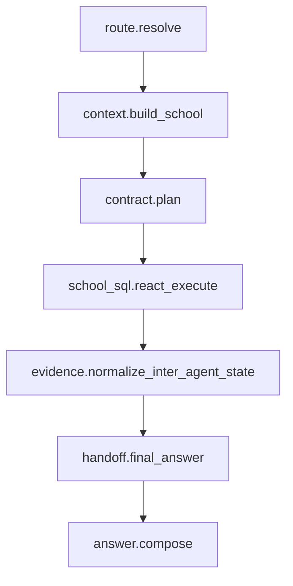

# 多智能体迭代资产包

本文档定义 conduct 网关中多智能体系统的长期迭代资产。它不是 PRD，也不是接口速记；
它是控制面、数据面、提示词面、工具面和回归账本的 Docs-as-Code 索引。

权威代码来源：

- Workflow contract：`gateway_core/agents/contracts/workflow_contracts.py`
- Output contract：`gateway_core/agents/contracts/output_contracts.py`
- Tool contract：`gateway_core/agents/contracts/tool_contract.py`
- Inter-agent state：`gateway_core/agents/contracts/inter_agent_state.py`
- School SQL executor：`gateway_core/agents/school_sql/sql_tools.py`
- Final handoff：`gateway_core/agents/school_sql/final_handoff.py`
- Stream orchestration：`gateway_core/agents/school_sql/agent_stream.py`
- Prompt registry：`gateway_core/prompts/prompt_layer.py`
- Tool registry：`gateway_core/tools/catalog/non_sql.py`

维护规则：

- 改 workflow、agent、tool、prompt、handoff、stream 策略时，必须同步更新本文档或责任卡片。
- 文档用中文说明，代码标识符、路径、prompt id、tool name 保持英文原样。
- 单测读取这些 Markdown，防止文档和代码契约漂移。

## 1. 图拓扑与状态机转移矩阵

标准学校数据问答 workflow 是 `SCHOOL_DATA_ANSWER_WORKFLOW`。



节点转移矩阵：

| Step | Executor | Reads | Writes | Produces | Must not read |
| --- | --- | --- | --- | --- | --- |
| `route.resolve` | `gateway` | request headers, messages | route, tenant | `route_decision` | runtime secret |
| `context.build_school` | `context_builder` | tenant, question | schema context, SQL experience, business prompt context | `selected_context` | raw rows |
| `contract.plan` | `contract_planner` | question, conversation, schema, DDL, business context | `tool_contract`, `required_outputs` | `PerTurnContractPlan` | raw rows |
| `school_sql.react_execute` | `school_sql_react` | question, tool contract, schema, conversation | `data_evidence`, `evidence_board`, `source_views` | `data_evidence` | `raw_rows_without_ref`, runtime secret |
| `evidence.normalize_inter_agent_state` | `workflow` | data evidence, evidence board, source views, tool contract | `inter_agent_state` | `InterAgentState` | `raw_rows_without_ref`, runtime secret |
| `handoff.final_answer` | `workflow` | inter-agent state | `handoff_payload` | `FinalAnswerHandoff` | raw rows |
| `answer.compose` | `final_answer` | handoff payload, business prompt context | final answer | `final_answer` | `raw_rows_without_ref`, runtime secret |

修改 `graph_builder.py`、`workflow_contracts.py` 或 `agent_stream.py` 的跳转逻辑时，
必须同步检查本矩阵。

## 2. 规划契约与多模态产物注册表

`PerTurnContractPlan` 在单轮开始时决定本轮注意力边界：

- `route`：`data` 或 `chat`。
- `required_outputs`：必须完成的输出槽，例如 `data_evidence`、`image_artifact`。
- `allowed_tools`：本轮可见的非 SQL 工具。
- `answer_mode`：`text`、`data`、`image`、`plot`、`chart`、`slide` 或 `multi`。
- `answer_focus`：回答焦点，不能替代证据。

产物注册表：

| Output slot | Tool / skill | 标准产物 | 边界 |
| --- | --- | --- | --- |
| `data_evidence` | `school_sql` | SQL evidence payload | 只能来自 DDL-first 只读 SQL 证据。 |
| `policy_evidence` | `policy.official_policy_search` | official policy sources/artifact | 不能替代校内事实。 |
| `web_evidence` | `web.search` | web search sources/artifact | 不能发送敏感上下文。 |
| `chart_artifact` | `artifact.chart` | HTML/JSON/SVG | 只能基于已有 rows。 |
| `plot_artifact` | `artifact.plot` | PNG/JSON | 只能基于已有 rows。 |
| `image_artifact` | `artifact.image_generate` / `image_generator` | image artifact | 不查 SQL。 |
| `slide_artifact` | `artifact.slide_generate` / `ppt_generator` | PPTX/preview/source | 不创建 SQL lineage。 |

## 3. 工具血缘与数据沙箱白名单

School SQL 内部工具的安全顺序：

```text
ddl_search
  -> inspect_table_schema / sample_table_rows / inspect_jsonb_recordset
  -> sql_db_query / jsonb_recordset_query
  -> evidence_by_task
  -> ToolContract.record_tool_result
  -> InterAgentState
```

工具边界：

- 只有 `ddl_search` 能扩大 SQL 白名单。
- `inspect_table_schema` 和 `sample_table_rows` 只能补证据，不能扩大 SQL 白名单。
- `jsonb_recordset_query` 必须先通过 `inspect_jsonb_recordset` 的 `record_schema` 检查。
- `chart` / `plot` 禁止执行 SQL，只接受已有 `rows` / `evidence_rows`。
- `web.search` 必须隐私清洗，不能发送学生、教师、手机号等敏感上下文。

`RawDataEvidencePayload` 是 `data_evidence` 的字段级硬门禁。必填字段：

| Field | Contract |
| --- | --- |
| `task_id` | 非空字符串。 |
| `allowed` | 必须是 `True`。 |
| `intent` | 非空字符串，例如 `raw_sql_select` 或 `jsonb_recordset_select`。 |
| `dataset_label` | 非空字符串。 |
| `row_count` | 非负整数。 |
| `sql_lineage` | dict，记录 SQL 血缘、表、行数、hash 或 evidence ref。 |
| `evidence_summary` | dict，记录证据摘要和可回答事实。 |
| `raw_sql_handle` | 非空字符串，指向完整原始行的 trace/ref。 |

样本与截断规则：

- `row_count > 0` 时必须存在 `row_sample` 或 `display_rows`。
- 样本截断只允许使用原生切片，例如 `data[:top_n]`。
- `RawDataPolicy` 必须保留 `original_count`、`included_count`、`truncated`。
- `InterAgentState` 不能嵌入无界 `raw_rows`。

失败策略：

- 缺字段、类型错误、`allowed` 不是 `True`、样本缺失，必须 fast-fail。
- 禁止 broad `except Exception` 把合同错误降级成 warning 或 fallback payload。
- `ToolContract` 只有在 `validate_data_evidence_payload()` 通过后，才能标记
  `completed_outputs.add("data_evidence")`。

## 4. 高维证据与柔性角色提示词资产库

提示词资产的权威入口：

- Prompt registry：`gateway_core/prompts/prompt_layer.py`
- Contract planner prompt：`gateway_core/prompts/agents/contract_planner.py`
- School SQL prompt：`gateway_core/prompts/agents/school_sql_agent.py`
- Final answer prompt：`gateway_core/prompts/agents/final_answer.py`
- Evidence rules：`gateway_core/prompts/rules/answer_evidence.py`
- Output contract prompt text：`gateway_core/prompts/output_contracts/`

隔离规则：

- 数据供给侧只产出证据，不写最终长答案。
- 最终答复侧只消费 `handoff_payload`、`InterAgentState` 和业务提示词上下文。
- 角色提示词只能作为背景约束，不得扩大 SQL 查询范围。
- 禁止把“必须 Markdown 表格”“必须结论先行”等格式锁写回证据层。

## 5. 流式分流策略与响应合成协议

前端通信由 OpenAI-compatible JSON/SSE 协议承接。

流式策略：

| 内容类型 | 可见位置 | 规则 |
| --- | --- | --- |
| 最终回答正文 | `content` | 只允许 final answer / responder 产出。 |
| 规划、SQL 推理、工具调用过程 | `reasoning_content` 或 trace | 不进入最终正文。 |
| 工具原始 payload | trace / artifact | 不直接串进用户可见正文。 |
| artifact URL / preview | artifact channel 或 handoff | 必须经过 artifact allowlist 和 proof。 |

协议规则：

- 非流式响应必须保持 OpenAI-compatible JSON。
- SSE chunk 不能混入 Python repr、单引号 dict 或未序列化对象。
- `final_answer_handoff` 输出的是紧凑 JSON 桥梁，不是最终自然语言答案。

## 6. 回归单测与性能对账测试账本

文档和代码共同受以下测试保护：

| 测试 | 保护内容 |
| --- | --- |
| `tests/test_agent_tool_prompt_inventory.py` | 文档清单、责任卡片、工具和 prompt 反漂移。 |
| `tests/test_output_contracts.py` | output contract、`InterAgentState` ref/sample/lineage。 |
| `tests/test_tool_contract.py` | `ToolContract` required outputs 完成状态。 |
| `tests/test_workflow_contracts.py` | workflow graph、node reads/writes、trace contract。 |
| `tests/test_agent_stream_workflow_trace.py` | `InterAgentState` build trace。 |
| `tests/test_agent_stream_direct_snapshot.py` | final handoff 和 answer composition。 |
| `tests/test_school_sql_tool_authorization.py` | DDL-first allowlist 与 JSONB recordset 守门。 |
| `tests/test_artifact_tools_contract.py` | artifact tools 不执行 SQL、不伪造 rows。 |

性能和 trace 账本：

- 合法的学校数据问答 trace 必须包含 route、plan、tool/evidence、handoff、answer。
- `SCHOOL_DATA_ANSWER_WORKFLOW.completion.max_step_count` 是当前工作流步数上限。
- 长尾 I/O、COUNT 探测、coverage probing 等策略必须通过环境变量显式开关和默认值管理。
- Langfuse/Phoenix 观测失败不能改变业务结果，但不能吞掉合同错误。

## 更新检查清单

改动以下文件时，必须同步检查对应文档和测试：

| 改动文件 | 必查文档 | 必跑测试 |
| --- | --- | --- |
| `workflow_contracts.py` | 本文档第 1 节、inventory workflow 表 | `tests/test_workflow_contracts.py` |
| `inter_agent_state.py` | 本文档第 3 节、inventory contract 边界 | `tests/test_output_contracts.py` |
| `tool_contract.py` | 本文档第 3 节 | `tests/test_tool_contract.py` |
| `sql_tools.py` | tool responsibility cards、第 3 节 | `tests/test_school_sql_tool_authorization.py` |
| `agent_stream.py` / `final_handoff.py` | 第 5 节、contract 边界 | handoff / stream 专项测试 |
| `prompts/` | 第 4 节、prompt responsibility cards | prompt layer / contract planner 测试 |
