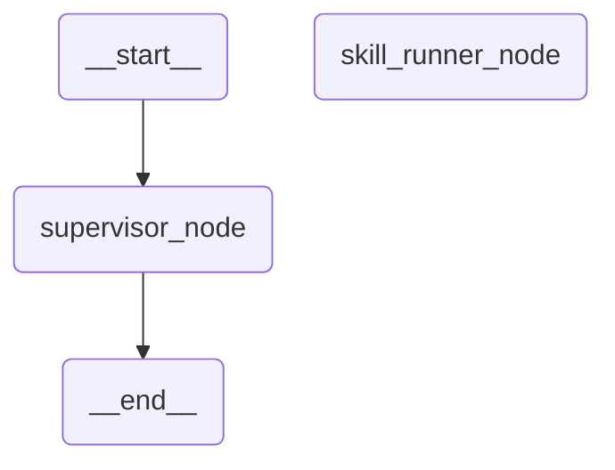

# MAS 多智能体网关全局数据流转拓扑大图

> 提示：可以直接在 VS Code Markdown 预览中查看，或复制下方代码至 mermaid.live。

> 注意：当前 Universal Hub 使用 Command(goto=...) 动态跳转；LangGraph 静态 Mermaid 可能不会展开这些运行期边，动态链路仍需结合 trace/SSE 事件核对。

```mermaid
---
config:
  flowchart:
    curve: linear
---
graph TD;
	__start__(<p>__start__</p>)
	supervisor_node(supervisor_node)
	skill_runner_node(skill_runner_node)
	__end__(<p>__end__</p>)
	__start__ --> supervisor_node;
	supervisor_node --> __end__;
	classDef default fill:#f2f0ff,line-height:1.2
	classDef first fill-opacity:0
	classDef last fill:#bfb6fc

```
